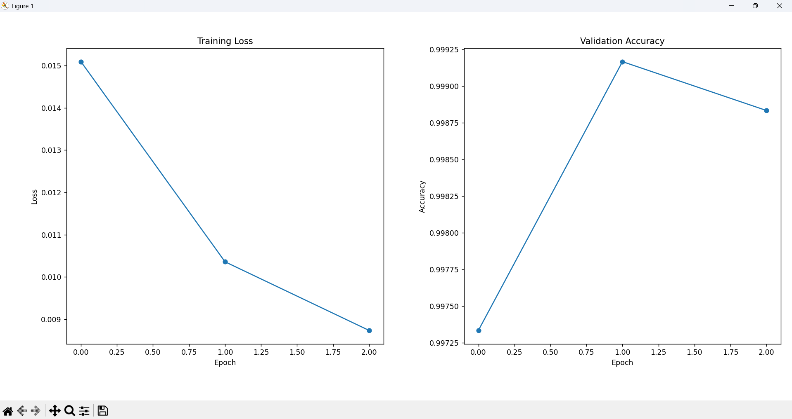

## Problem Definition

Concrete structures are widely used in civil engineering, and early detection of surface cracks is critical for ensuring structural safety and reducing maintenance costs. Manual inspection of concrete surfaces is time-consuming, subjective, and prone to human error, especially when dealing with large-scale infrastructures.

This project addresses a binary image classification problem aimed at determining whether a given concrete surface image contains a crack or not. Each input sample is a small RGB image patch extracted from a larger concrete surface, and the task is to classify it into one of the following two categories:

Crack (Positive): The image patch contains visible crack patterns.

No Crack (Negative): The image patch does not contain any crack.

The problem is formulated as a supervised learning task, where labeled image patches are used to train a deep learning model capable of learning discriminative visual features associated with crack presence.

It is important to note that this project focuses on image-level classification, not on crack localization or segmentation. The model predicts only the presence or absence of cracks within an image patch and does not provide information about crack location, shape, or size.

Due to the texture-rich and locally varying nature of concrete surfaces, traditional pixel-based or linear models are insufficient to capture the underlying patterns. Therefore, convolutional neural networks (CNNs) are employed to effectively learn hierarchical spatial features from the input images.

## Dataset Description

The dataset used in this project consists of RGB images of concrete surfaces, labeled according to the presence or absence of visible cracks. It is a widely used benchmark dataset for crack classification tasks in structural inspection and computer vision research.

Each image in the dataset represents a fixed-size image patch (227 × 227 pixels) extracted from larger concrete surface photographs. The dataset contains two classes:

Positive (Crack): Image patches that include visible crack patterns.

Negative (No Crack): Image patches that do not contain cracks.

The total dataset includes approximately 40,000 image patches, evenly distributed between the two classes. These patches are generated through a systematic patch extraction process, where larger concrete surface images are divided into smaller regions. This approach significantly increases the number of training samples while preserving local structural details relevant to crack detection.

It is important to emphasize that, although the dataset appears large in terms of the number of image samples, the effective diversity of visual information is lower than the raw sample count suggests. Multiple patches may originate from the same original concrete surface image, potentially introducing spatial correlation between samples.

As a result, this patch-based dataset design carries a risk of data leakage if patches derived from the same original image appear in both training and validation sets. While this limitation is acceptable for educational and benchmarking purposes, it should be carefully considered in real-world deployment scenarios. In production-level systems, dataset splitting should ideally be performed at the level of original images rather than individual patches.

Despite these limitations, the dataset provides a practical and realistic foundation for learning and evaluating convolutional neural networks on texture-based defect classification problems.

## Model Selection – Why ResNet18?

In this project, **ResNet18** is selected as the backbone convolutional neural network for concrete crack classification. The choice of this architecture is motivated by both **technical suitability** and **practical constraints** of the problem.

### Residual Learning Advantage

Deep neural networks often suffer from vanishing gradients as depth increases, making training difficult and unstable. ResNet addresses this issue through **residual connections**, which allow the model to learn residual mappings instead of direct mappings. This enables:

* More stable training
* Faster convergence
* Better generalization on visual patterns such as cracks

### Suitability for Crack Detection

Concrete crack detection relies heavily on:

* Edge patterns
* Texture irregularities
* Local structural disruptions

ResNet18 is deep enough to capture these hierarchical visual features while remaining compact enough to avoid overfitting, especially when trained on a dataset derived from limited real-world samples.

### Computational Efficiency

Compared to deeper variants (e.g., ResNet50 or ResNet101), ResNet18:

* Has significantly fewer parameters
* Requires less memory and computational power
* Trains faster on limited hardware

This makes it well-suited for educational environments and practical deployment scenarios where resources may be constrained.

### Transfer Learning Compatibility

ResNet18 is commonly pretrained on **ImageNet**, allowing the use of **transfer learning**. By leveraging pretrained weights:

* Low-level visual features are reused
* Training time is reduced
* Performance improves even with limited labeled data

In this project, the pretrained ResNet18 model is fine-tuned for binary classification (crack vs. non-crack) by replacing the final fully connected layer.

### Design Decision Summary

The selection of ResNet18 represents a balanced engineering decision:

* ✔ Sufficient representational power
* ✔ Stable training behavior
* ✔ Efficient computation
* ✔ Strong transfer learning support

This makes ResNet18 an appropriate and effective model choice for the concrete crack classification task.

## Training Strategy

This project follows a **transfer learning–based training strategy** to efficiently train a deep convolutional neural network for concrete crack classification.

### Transfer Learning Setup

A pretrained **ResNet18** model (trained on ImageNet) is used as the base network. The final fully connected layer is replaced to match the binary classification task:

* Crack
* Non-crack

This approach allows the model to reuse low-level and mid-level visual features such as edges, textures, and shapes, which are also relevant for crack detection.

### Fine-Tuning Approach

Rather than training the network from scratch, the model is **fine-tuned**:

* Early convolutional layers retain pretrained weights
* The final classification layer is trained from scratch
* Optional fine-tuning of deeper layers can be enabled depending on validation performance

This balances generalization and task-specific learning.

### Loss Function

The training objective is formulated as a **binary classification problem**. Therefore:

* **Cross-Entropy Loss** is used

Cross-entropy loss is well-suited for probabilistic classification tasks and provides stable gradients during training.

### Optimizer

The model is trained using:

* **Adam optimizer**

Adam combines the advantages of momentum-based optimization and adaptive learning rates, enabling faster and more stable convergence compared to vanilla stochastic gradient descent.

### Learning Rate Strategy

A relatively small learning rate is selected to avoid destroying pretrained weights:

* Typical learning rate: `1e-4`

This is particularly important when fine-tuning pretrained networks.

### Batch Size and Epochs

* **Batch size** is chosen to balance memory constraints and gradient stability
* **Number of epochs** is selected based on convergence behavior and validation performance

Early stopping or validation monitoring may be used to prevent overfitting.

### Data Handling

The dataset is loaded using PyTorch `DataLoader`, enabling:

* Mini-batch training
* Data shuffling
* Efficient GPU utilization (if available)

Standard image transformations such as resizing and normalization are applied to match ImageNet preprocessing standards.

### Training Workflow Summary

1. Load pretrained ResNet18
2. Replace final classification layer
3. Apply data preprocessing and loading
4. Train model using cross-entropy loss and Adam optimizer
5. Monitor validation performance
6. Save the best-performing model

This training strategy ensures efficient learning, stable convergence, and robust classification performance for the concrete crack detection task.

## Results & Evaluation

The performance of the trained model was evaluated on a held-out test dataset consisting of concrete surface image patches that were not seen during training.

### Evaluation Metrics

To assess the effectiveness of the binary classification model, the following metrics were used:

* **Accuracy**: Measures the overall proportion of correctly classified images.
* **Confusion Matrix**: Provides a detailed breakdown of true positives, true negatives, false positives, and false negatives.

Accuracy is chosen as the primary metric due to the balanced nature of the dataset, while the confusion matrix offers deeper insight into the types of classification errors made by the model.

### Test Results

The final model was evaluated on a held-out test set that was not used during training or validation:

- **Test Accuracy** : 99.92%
- **Test Precision**: 99.97%
- **Test Recall**   : 99.87%
- **Test F1-score** : 99.92%

These results indicate excellent generalization performance on unseen data. The high scores are primarily attributed to the cleanliness of the dataset and the clear visual separability between crack and non-crack samples, rather than excessive model complexity.

### Training Curves

The following figure shows the training loss and validation accuracy over 3 epochs:

### Classification Performance

The trained ResNet18-based classifier demonstrates strong performance in distinguishing between cracked and non-cracked concrete surfaces. The model successfully captures visual patterns such as crack edges, texture discontinuities, and surface irregularities.

A high accuracy score indicates that the model generalizes well to unseen data patches. The confusion matrix further shows that both classes are learned effectively, with relatively low misclassification rates.

### Error Analysis

Most classification errors occur in visually ambiguous cases, such as:

* Very thin or hairline cracks
* Surface textures that resemble cracks due to lighting or noise
* Partial cracks appearing near patch boundaries

These errors highlight the inherent difficulty of patch-based crack classification and suggest potential improvements through higher-resolution inputs or spatial context modeling.

### Model Behavior Interpretation

The results confirm that transfer learning with ResNet18 is effective for this task. Pretrained convolutional filters enable the model to leverage general visual features, while fine-tuning allows adaptation to crack-specific patterns.

Although the model performs well at the image-patch level, it does not provide information about crack location or severity, which remains outside the scope of this classification-based approach.

### Summary of Results

* The model achieves strong classification accuracy on unseen test data
* Both crack and non-crack classes are learned effectively
* Errors are primarily associated with ambiguous visual patterns

Overall, the evaluation results validate the chosen model architecture and training strategy for the concrete crack classification problem.

### Model Performance Interpretation

The consistently high accuracy values are largely attributable to the cleanliness of the dataset and the clear visual distinction between crack and non-crack samples.  
This allows the model to learn discriminative features quickly, even with a small number of training epochs.  
Therefore, the strong performance should be interpreted as a reflection of dataset separability rather than excessive model complexity or overfitting.

## Limitations & Future Work

While the proposed ResNet18-based classifier achieves strong performance on the given dataset, several limitations should be acknowledged. Understanding these limitations is critical for interpreting the results correctly and for guiding future improvements.

### Limitations

#### Patch-Based Dataset Structure

The dataset consists of fixed-size image patches extracted from larger concrete surface images. Although this increases the number of training samples, it introduces several constraints:

* Multiple patches may originate from the same original image
* Spatial correlation between samples may exist
* There is a potential risk of data leakage if patches from the same source image appear in both training and test sets

As a result, reported accuracy may slightly overestimate real-world performance.

#### Lack of Spatial Localization

This project addresses **classification**, not **localization**. The model predicts whether a given image patch contains a crack but does not:

* Identify the crack location
* Estimate crack length or width
* Provide severity or progression analysis

For structural health monitoring applications, localization is often as important as classification.

#### Limited Real-World Variability

Although the dataset contains a large number of samples, the effective diversity is limited by:

* Controlled image acquisition conditions
* Patch extraction from a smaller set of original images
* Absence of extreme lighting, weather, or surface contamination scenarios

This may reduce generalization to real-world inspection environments.

#### Binary Labeling Constraint

The dataset uses binary labels (crack vs. non-crack), which simplifies the problem but ignores:

* Crack severity levels
* Micro-cracks versus structural cracks
* Temporal evolution of cracks

Such information is essential for risk assessment in real engineering applications.

---

### Future Work

Several extensions can be explored to improve the robustness and applicability of this system:

* **Object Detection or Segmentation Models**: Using architectures such as Faster R-CNN, YOLO, or U-Net to localize cracks at the pixel or bounding-box level.
* **Image-Level Splitting Strategy**: Ensuring that all patches from a given original image belong exclusively to either the training or test set to prevent leakage.
* **Multi-Class or Regression Outputs**: Extending the model to predict crack severity, width, or length.
* **Data Collection from Real Environments**: Incorporating images captured under diverse lighting and environmental conditions.
* **Temporal Analysis**: Monitoring crack progression over time using sequential image data.

---

### Final Remarks

Despite these limitations, this project demonstrates that transfer learning with convolutional neural networks is an effective approach for concrete crack classification. The identified limitations provide clear directions for future research and real-world deployment improvements.
